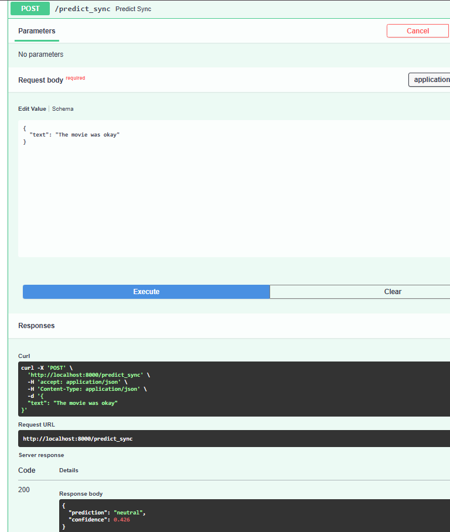
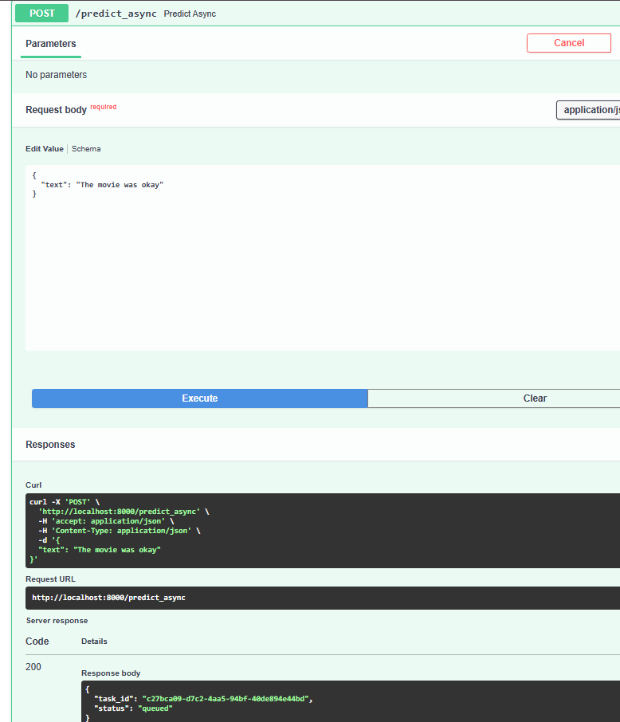
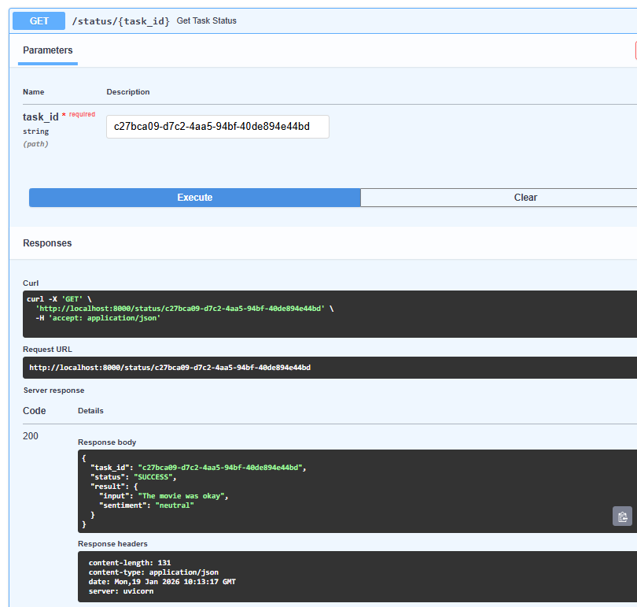
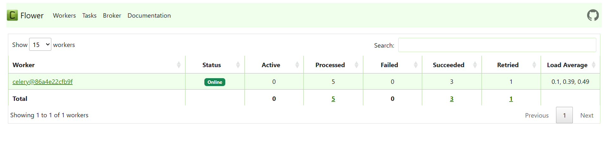
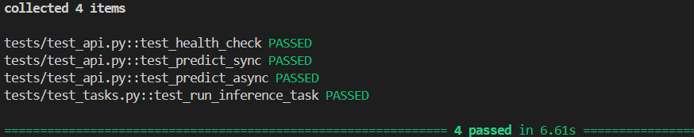

#  AI Inference Service (Async & Scalable)

A production-ready **AI Inference Service** built using **FastAPI, Celery, Redis, Docker, and Flower**.
This project demonstrates **synchronous and asynchronous model inference**, background task processing, containerization, and automated testing.

## Objective

The goal of this project is to build a scalable AI inference system that:

* Handles **real-time and background predictions**
* Prevents API blocking using **Celery workers**
* Uses **Redis** as a reliable message broker
* Runs fully inside **Docker containers**
* Provides **monitoring**, **testing**, and **clean architecture**

##  Architecture Overview

This system follows an **asynchronous microservice architecture**.

### 🔹 Components

* **FastAPI**

  * Serves REST APIs
  * Handles request validation and responses
  * Triggers background inference tasks

* **Celery**

  * Executes long-running AI inference asynchronously
  * Prevents blocking of API requests
  * Communicates with Redis as a broker

* **Redis**

  * Acts as message broker for Celery
  * Stores task states and results

* **Flower**

  * Web-based Celery monitoring dashboard
  * Shows task status, worker health, and queues

* **Docker & Docker Compose**

  * Containerizes all services
  * Ensures consistent environments
  * Allows one-command startup

##  Request Flow

1. Client sends a request to FastAPI
2. FastAPI:

   * Runs inference directly (**sync**)
   * OR sends inference job to Celery (**async**)
3. Celery worker processes the task
4. Result is stored in Redis
5. Client checks task status and retrieves result

##  Project Structure

AI_Inference_Service/
│
├── app/
│   ├── main.py              # FastAPI app
│   ├── tasks.py             # Celery tasks
│   ├── model.py             # ML model logic
│   ├── schemas.py           # Pydantic schemas
│
├── tests/
│   ├── test_api.py          # API tests
│   ├── test_tasks.py        # Celery task tests
│
├── Dockerfile.api           # FastAPI container
├── Dockerfile.worker        # Celery worker container
├── docker-compose.yml
├── requirements.txt
├── README.md

##  API Endpoints

###  Health Check

**GET** `/health`

Checks service availability.

**Response**

{
  "status": "ok"
}

### 🔹 Synchronous Prediction

**POST** `/predict_sync`

Runs inference immediately.

**Request**

{
  "text": "I really loved this movie"
}

**Response**

{
  "prediction": "positive"
}

### Asynchronous Prediction

**POST** `/predict_async`

Queues inference task.

**Request**

{
  "text": "I really loved this movie"
}

**Response**

{
  "task_id": "01e3f1",
  "status": "queued"
}

###  Task Status

**GET** `/tasks/{task_id}`

Checks background task status.

**Response (Completed)**

{
  "task_id": "01e3f1",
  "status": "completed",
  "result": {
    "sentiment": "positive"
  }
}

##  Running with Docker

###  Build and Start Services

docker-compose up --build

###  Services Started

| Service | Port |
| ------- | ---- |
| FastAPI | 8000 |
| Redis   | 6379 |
| Flower  | 5555 |

##  Celery Monitoring (Flower)

Access Flower dashboard at:

http://localhost:5555

You can:

* View task status
* Monitor worker health
* Inspect queues

##  Running Tests

All tests are executed **inside Docker containers**.

docker exec -it fastapi-service pytest -v

###  Test Coverage

* Health endpoint
* Sync prediction
* Async prediction
* Celery task execution

### ✔ Test Result

4 passed in Docker environment

## Technologies Used

* **FastAPI**
* **Celery**
* **Redis**
* **Docker & Docker Compose**
* **Flower**
* **Pytest**
* **Scikit-learn**
* **NumPy**

Architecture Diagram :

Client
  |
  v
FastAPI (API Service)
  |
  |-- Sync Prediction --> ML Model
  |
  |-- Async Prediction --> Redis --> Celery Worker --> ML Model
                                  |
                                  v
                               Result

##  Screenshots 
###  Synchronous Prediction (`/predict_sync`)

###  Asynchronous Prediction (`/predict_async`)

###  Task Status Check

###  Celery Monitoring (Flower)

###  Test Results (Pytest)

